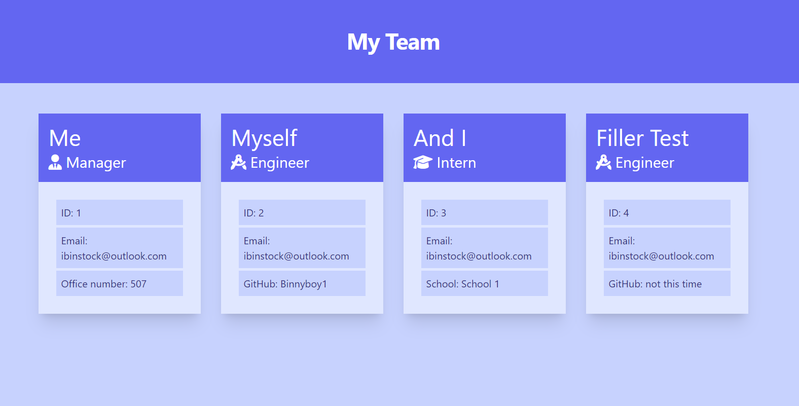

# OOP-Team-Profile-Generator

## Description

This is the 'Module 10' challenge assignment for the UCF coding bootcamp.

We were tasked with creating a Team Profile Generator from scratch that would allow us to add team members and display their details in a browser. This project gave us practice with working with Object Oriented Programming, such as working with classes and subclasses. 

## Installation

1. Git clone repo into VSCode
2. Right click `index.js` file and select `Open in Integrated Terminal`
3. Run `npm init -y`
4. Run `npm i inquirer@8.2.4`
5. Run `npm i jest`

## Usage

In the terminal, run `npm run test`and fill out all the questions. Doing so will create an html file within the `dist` folder called `index.html`.

Right click `index.html` file and select `Open with Live Server` to view the newly created Team member page in a browser.

[Demo](https://drive.google.com/file/d/1JodwnZ_2eSbFy6e7hIGN4CSbx6zwY6KU/view)